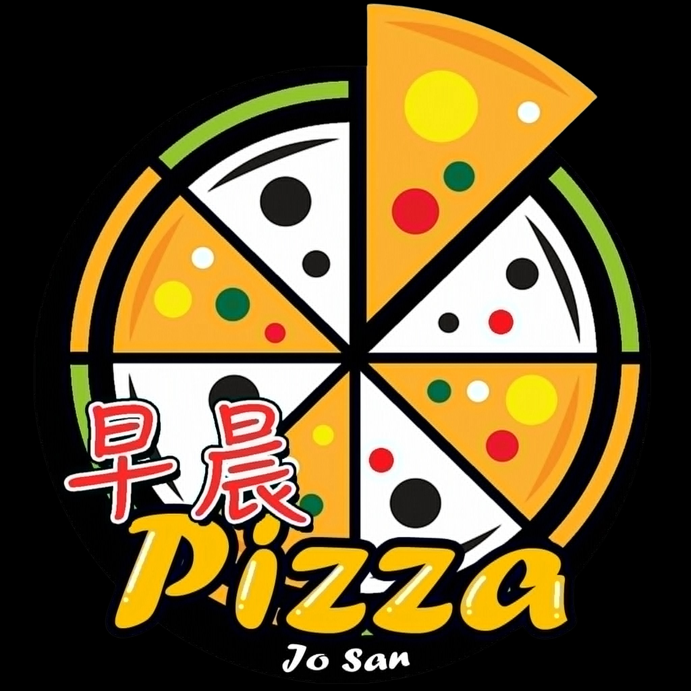

# 🍕 Jo San Pizza (早晨) — Every Slice Tells a Story

  
  
<em>Where Filipino Heart Meets Italian Soul. Crafted with love in Bambang, Nueva Vizcaya.</em>

  
  
  
  
  
  

---

---

## The Story Behind the Slice

**Jo San Pizza** is an authentic Filipino-Chinese pizza restaurant located in the heart of Bambang, Nueva Vizcaya (Tokyo Building, San Fernando Road, Calaocan). 

The name **"Jo San"** is inspired by the Cantonese Chinese phrase **"早晨" (Jo San)**, which translates directly to **"Good Morning"**. We believe every meal should carry the freshness, warmth, and hope of a beautiful new morning. By blending traditional Italian hand-stretched dough techniques, rich house-made sauces, and local Filipino-Chinese flavors, we bring families together one delicious slice at a time.

---

## Features

### 🍽️ Customer Showcase (Frontend)
- **Interactive Landing Page**: A responsive hero section with scrolling indicators, micro-animations, and animated brand graphics.
- **Story Telling**: A section sharing our history, combined with dynamic customer-engagement counters.
- **Best Sellers Grid**: Displays the top 4 highly rated items, fetched dynamically from the database.
- **Menu Variations**: Supports dynamic size option labels (e.g., *Solo*, *Family*) and prices.
- **Comprehensive Digital Menu**: Full categorization of our menu items (Pizzas, Pastas, Sides, Drinks) with detailed descriptions.
- **Contact & Map Integration**: Easy links to order via Facebook Messenger, check store hours, or locate the branch in Calaocan, Bambang.

### Administrative Management (Admin Portal)
- **Role-Based Authentication**: Secure admin and staff login.
- **Menu Manager (Full CRUD)**:
  - Add, update, view, and delete items.
  - Upload pizza photos directly via **Multer**.
  - Toggle item availability and mark best sellers (automatically capped at 4 items max).
  - Add multiple price variations per item.
- **Category Control**: Dynamic categorization of food items.
- **Staff Administration**: Manage permissions, add additional admin accounts, and oversee platform access.
- **Auto-Seeding Database**: Automatically provisions a default admin account (`admin` / `admin123`) on system launch if no admins exist.

---

## Tech Stack

| Layer | Technology | Purpose |
| :--- | :--- | :--- |
| **Frontend Core** | [React 18](https://reactjs.org/) + [Vite](https://vitejs.dev/) | High-performance client-side rendering & blazing fast development builds |
| **Styling** | [Tailwind CSS](https://tailwindcss.com/) | Modern utility-first CSS styling framework |
| **State & Navigation** | React Context API & React Router DOM | Global authentication context and declarative routing |
| **API Client** | [Axios](https://axios-http.com/) | Promise-based HTTP client for backend communication |
| **Toast Notifications** | [React Hot Toast](https://react-hot-toast.com/) | Elegant, customizable responsive micro-alerts |
| **Backend Framework** | [Express.js](https://expressjs.com/) on [Node.js](https://nodejs.org/) | Scalable, light REST API gateway |
| **Database** | [MongoDB](https://www.mongodb.com/) & [Mongoose ODM](https://mongoosejs.com/) | Flexible NoSQL document database and schema-based modeling |
| **File Storage** | [Multer Middleware](https://github.com/expressjs/multer) | Server-side multipart/form-data upload for item photos |
| **Security** | [JSON Web Tokens (JWT)](https://jwt.io/) & [bcryptjs](https://github.com/dcodeIO/bcrypt.js) | Session verification and strong password hashing |
